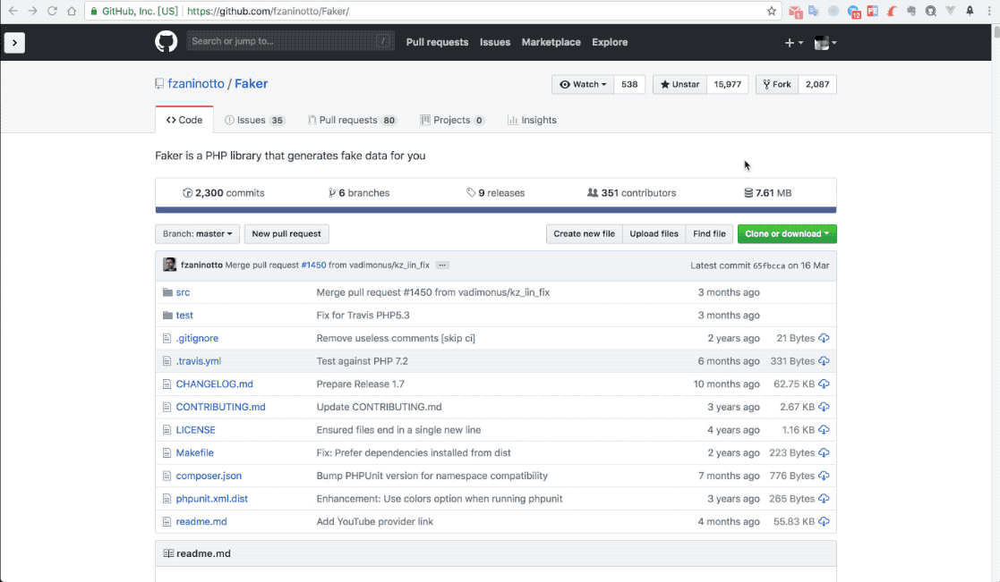

# Github Rocket

**Github Rocket** is a extension for Chrome which is used return to the top for Github README pages.

## Install

You can install it from [Chrome Web Store](https://chrome.google.com/webstore/detail/github-rocket/lkpnlpildkncjiiebeloogemkeomkfik?hl=zh-CN&gl=PH).

## Usage

**Just click it!** It will be there automatically when you need.

